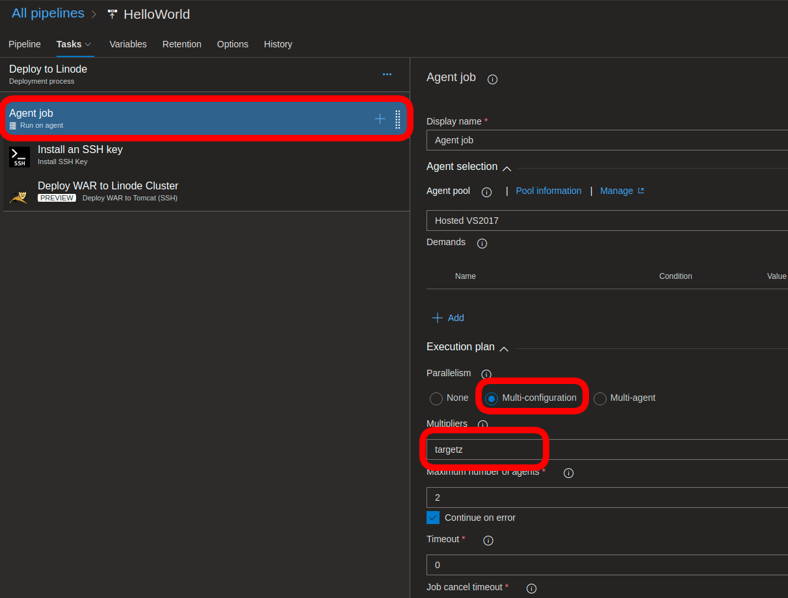
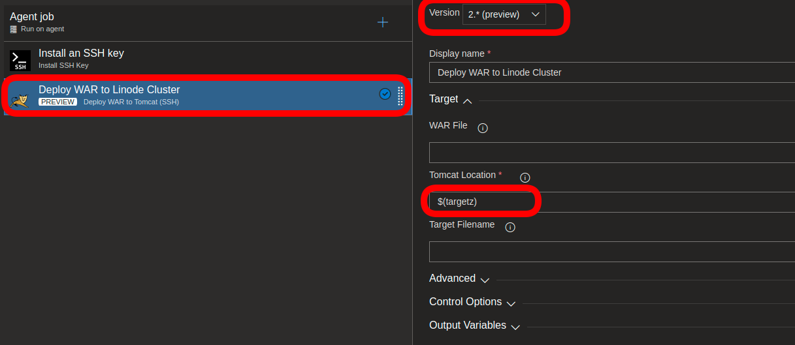

## Deploy WAR File over SSH Task
The **Deploy WAR File over SSH** Task deploys WAR files to preconfigured Apache Tomcat instances over SSH (obviously).  It assumes that you have already configured an Apache Tomcat instance, that you have public key SSH access to it  and that it can be started and stopped using  `$CATALINA_HOME/bin/startup.sh` and `$CATALINA_HOME/bin/shutdown.sh`

#### Version 2.x (Preview)
Changelog
* Adds support for parallelism through **Multi-configuration** parameter with a **Multiplier** set.  
* Improves warning/error handling
* Laissez-faire startup mode: if a tomcat instance is shut down at deploy time, it will not be restarted after deployment

** Deploy to multiple Targets **
If you create a Variable in your pipeline which contains comma-separated deployment locations, you can use it
to deploy your war to multiple tomcat instances.

For example, if you have a release variable `targetz` set to `tomcat@myhost1:/home/tomcat/tomcat01, tomcat@myhost2:/home/tomcat/tomcat01`, 
you can configure the Job with parallelism:

Then reference the variable `targetz` in your task:

Parameters:
* CatalinaLocation
* WarFile
* TargetFilename
Advanced:
* Timeout
* SuccessString 

#### Version 1.x
This task requires that you use the [Install SSH Key](https://docs.microsoft.com/en-us/vsts/pipelines/tasks/utility/install-ssh-key?view=vsts) task as part of the current phase.
Parameters:
* SshUrl
* CatalinaHome
* WarFile
* TargetFilename
Advanced:
* Timeout
* SuccessString 

This version performs rudimentary checking on parameters to make sure that WarFile exists, CatalinaHome exists, that the TargetFilename is actuall a war file, that the SshUrl is `username@hostname`.  

If WarFile isn't specified, the task will recursively scan for war files and, if it finds a single file, will deploy that one.  If no `TargetFilename` is given, then the original `WarFile` name will be used.

## Deploy WAR Template
This extension includes a Release Stage Template which includes the required SSH key and Deploy War tasks.  When adding a new Stage to a Release Pipeline, this will appear when you click "+ Add."  You can search for "war" in the Select a template window to find it.  The following environment-scoped Variables will be added to your Release Pipeline when you use this template:
* SshUrl
* CatalinaHome
* TargetFilename

